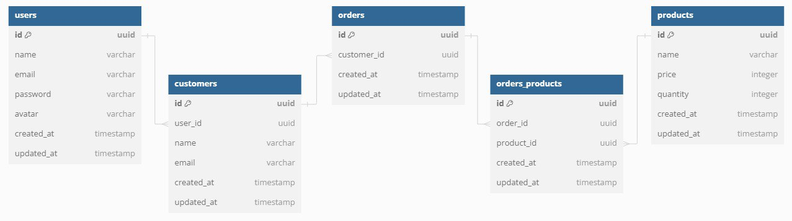

# 💻 API de Vendas

# Endpoints

#### /users

- POST - /users (Create New User)
- GET - /users (Get All Users)

#### /profile

- PUT - /profile (Update User Profile)

#### /sessions

- POST - /sessions (Create a JWT Token for Authenticate)

#### /password

- POST - /password/forgot (Send email for forgotten password)
- POST - /password/reset (Reset Password)

#### /customers

- POST - /customers (Register New Customer)
- PUT - /customers/:id (Update Customer)
- DELETE - /customers/:id (Delete Customer)
- GET - /customers (Get All Customers)

#### /products

- POST - /products (Register New Product)
- PUT - /products/:id (Update Product)
- DELETE - /products/:id (Delete Product)
- GET - /products (Get All Products)

#### /orders

- POST - /orders (Create New Order)
- GET - /orders (Get All Orders)
- GET - /orders/:id (Get Items Ordered)

## :rocket: Tecnologias

- ✅ [Node.js](https://nodejs.org)
- ✅ [Express](https://expressjs.com)
- ✅ [TypeScript](https://www.typescriptlang.org)
- ✅ [PostgreSQL](https://www.postgresql.org)
- ✅ [TypeORM](https://typeorm.io/)
- ✅ [Docker](https://www.docker.com)
- ✅ [Redis](https://redis.io)
- ✅ [Jest](https://jestjs.io)
- ✅ [JWT-token](https://jwt.io)
- ✅ [uuidV4](https://github.com/uuidjs/uuid)
- ✅ [Celebrate](https://github.com/arb/celebrate)

# Diagrama

## Cadastro de Usuário

**RF**

- [x] Deve ser possível cadastrar um novo usuário.

**RN**

- [x] Não deve ser possível cadastrar dois usuários com mesmo email.

**RNF**

- [x] O sistema deve utilizar o banco de dados relacional PostgreSQL para armazenar dados de forma eficiente, garantindo integridade e consistência.

## Atualização de Usuário

**RF**

- [x] Deve ser possível atualizar dados de cadastro do usuário.

**RN**

- [x] Não deve ser possível atualizar dados de um usuário inexistente.
- [x] Não deve ser possível atualizar dados de um usuário usando um email cadastrado por outro usuário.
- [x] Não deve ser possível atualizar para uma nova senha sem informar a senha antiga.

## Listagem de Usuário

**RF**

- [x] Deve ser possível listar todos usuários.

## Autenticação de Usuário

**RF**

- [x] Deve ser possível autenticar um usuário.

**RN**

- [x] Não deve ser possível autenticar um usuário inexistente.
- [x] Não deve ser possível autenticar um usuário com senha incorreta.
- [x] Ao realizar a autenticação do usuário, um token de acesso JWT deve ser gerado.

**RNF**

- [x] O token de acesso utilizado pelo sistema deve ser JWT (JSON Web Token) para a geração e validação de tokens de autenticação, garantindo segurança e interoperabilidade.

## Recuperar Senha

**RF**

- [x] Deve ser possível o usuário recuperar a senha informando o e-mail.
- [x] O usuário deve receber um e-mail com o passo a passo para a recuperação da senha.
- [x] O usuário deve conseguir inserir uma nova senha.

**RN**

- [x] Não deve ser possível restaurar senha de um usuário inexistente.
- [x] O usuário precisa informar uma nova senha.
- [x] O link enviado para a recuperação deve expirar em 3 horas.

## Registrar Cliente

**RF**

- [x] Deve ser possível registrar um novo cliente.

**RN**

- [x] Não deve ser possível registrar dois clientes com mesmo email.

## Atualização de Cliente

**RF**

- [x] Deve ser possível atualizar um cliente.

**RN**

- [x] Não deve ser possível atualizar um cliente inexistente.
- [x] Não deve ser possível atualizar dados de um cliente usando um email cadastrado por outro cliente.

## Apagar Cliente

**RF**

- [x] Deve ser possível apagar um cliente.

**RN**

- [x] Não deve ser possível apagar um cliente inexistente.

## Listagem de Clientes

**RF**

- [x] Deve ser possível listar todos os clientes.

## Cadastrar Produto

**RF**

- [x] Deve ser possível cadastrar um novo produto.

**RN**

- [x] Não deve ser possível cadastrar um produto com nome já existente.

## Atualização de Produto

**RF**

- [x] Deve ser possível atualizar um produto.

**RN**

- [x] Não deve ser possível atualizar um produto inexistente.
- [x] Não deve ser possível atualizar um produto com nome já existente.

## Apagar Produto

**RF**

- [x] Deve ser possível apagar um produto.

**RN**

- [x] Não deve ser possível apagar um produto inexistente.

## Listagem de Produtos

**RF**

- [x] Deve ser possível listar todos os produtos disponíveis.

## Criar Pedido

**RF**

- Deve ser possível criar um novo pedido.

**RN**

- [x] Não deve ser possível criar um pedido para um cliente inexistente.
- [x] Não deve ser possível criar um pedido para um produto inexistente.
- [x] Não deve ser possível criar um pedido para produtos com quantidades insuficientes.

## Listagem de Pedidos

**RF**

- [x] Deve ser possível listar todos os pedidos realizados.

## Ver Itens do Pedidos

**RF**

- [x] Deve ser possível ver todos os itens do pedido realizado.

**RN**

- [x] Não deve  ser possível ver itens de um pedido inexistente.
